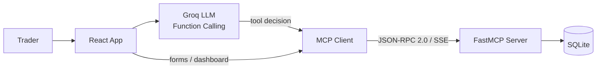

# AI-Powered Forex Trading Assistant

An end-to-end Forex trading companion that combines a **FastMCP backend**, **React web app**, and **Groq LLM function calling** so traders can log trades in natural language, get performance analytics, and receive risk warnings — all from one chat interface.

## Full Demo

Watch the complete working app (localhost, full chat flow, live tool calls):

**[Full App Demo — AI-Powered Forex Assistant](https://tinyurl.com/ai-powered-forex-assistant)**

The demo shows login, conversational trade logging, automatic P/L calculation, insights, and risk alerts running end-to-end.

---

## What This Project Does

Most trading journals are forms and spreadsheets. This app lets you **talk to your journal**:

- *"I took a BUY on XAU/USD, entry 2650, TP 2660, SL 2645, lot 0.02, balance 1010, 15m scalp, trendline strategy"* → trade saved with risk:reward and potential P/L
- *"It was a win"* → P/L and new balance calculated automatically
- *"How am I doing?"* → win rate, best timeframe, best strategy, buy vs sell stats
- *"Any risk alerts?"* → 10 pattern detectors flag revenge trading, overtrading, drawdown, and more

You can use the **Chat tab** for natural language, or the **Save Trade**, **Dashboard**, and **Risk Alerts** tabs for direct UI access. Both paths hit the same MCP server and SQLite database.

---

## Highlights (Built in Code)

| Area | What was implemented |
|------|----------------------|
| **MCP Server** | 6 tools deployed at `https://forex-trade-assistant.fastmcp.app/mcp` — auth, trade CRUD, analytics, risk |
| **LLM Layer** | Groq `llama-3.1-8b-instant` with function calling; validates fields, injects `user_id`, retries on rate limits |
| **P/L Engine** | XAU/USD formula: `P/L = price_move × (lot_size × 100)`; auto-computes on WIN/LOSS from TP/SL |
| **Analytics** | Win rate, profit factor, BUY vs SELL, lot-size impact, timeframe/strategy rankings, top 5 combos, R:R analysis |
| **Risk Monitor** | 10 alert types: consecutive losses, revenge trading, overconfidence, overtrading, high risk/trade, drawdown, emotional patterns, poor R:R, missing stop loss, total account risk |
| **Frontend** | React 18 + Vite — Chat, Trade Form, Analytics Dashboard, Risk Alerts; session + chat history in localStorage |
| **Data** | SQLite with user-scoped tables, indexes, migrations; SHA-256 salted password hashing |

---

## Architecture



**Request flow (chat):**

```
User message → Groq LLM picks tool → MCP Client → FastMCP Server → SQLite
                     ↑                                              ↓
              Formatted reply ← LLM formats result ← tool response ←┘
```

---

## Tech Stack

| Layer | Technologies |
|-------|--------------|
| Backend | Python 3.10+, FastMCP, aiosqlite, python-dotenv |
| Frontend | React 18, Vite 5, groq-sdk |
| AI | Groq API — `llama-3.1-8b-instant` with tool calling |
| Database | SQLite (`users`, `trade_tracker`, `trade_results`, `risk_monitor`, `analytics`) |
| Protocol | JSON-RPC 2.0 over HTTP with Server-Sent Events (SSE) |
| Deployment | FastMCP Cloud (backend), static host for frontend (Vercel/Netlify) |

---

## Features in Detail

### Conversational Trade Management (`groqClient.js` + `Chatbot.jsx`)

- Natural-language trade entry with step-by-step field collection when details are missing
- Exact value extraction from user messages (entry, lot, balance, TP, SL, timeframe, style, strategy)
- After save, prompts for WIN/LOSS and logs result with calculated P/L and updated balance
- Full conversation history passed to the LLM and persisted per user in `localStorage`
- Automatic rate-limit retry (up to 3 attempts) with backoff

### Trade Form (`TradeForm.jsx`)

Structured alternative to chat — same `save_trade` MCP tool with fields for entry, TP, SL, lot size, balance, BUY/SELL, currency pair, timeframe, trade style, strategy, and notes.

### Analytics Dashboard (`Dashboard.jsx` + `get_trade_insights`)

Pulls live data from the MCP server and displays:

- Summary: total/open/closed trades, win rate, total P/L
- Performance: average win, average loss, profit factor
- Best performing side (BUY vs SELL)
- Timeframe and strategy breakdowns with win rates and P/L
- Top 5 timeframe + strategy combinations
- Risk:reward analysis on winning vs losing trades

Filter via MCP: `currency_pair`, `timeframe`, `strategy`.

### Risk Alerts (`RiskAlerts.jsx` + `check_risk_alerts`)

Analyzes recent and open trades and returns severity-ranked alerts:

1. Consecutive losses  
2. Revenge trading (new trade within 1 hour of a loss)  
3. Overconfidence (win streak + increasing lot sizes)  
4. Overtrading (too many trades per hour)  
5. High risk per trade (% of balance)  
6. Drawdown from peak balance  
7. Emotional trading (high recent loss rate)  
8. Poor risk:reward (worse than 1:1)  
9. Missing stop loss  
10. Total account risk across open positions  

Alerts are stored in `risk_monitor` when the database is writable.

### Authentication (`Login.jsx` + MCP auth tools)

- Register and login through the UI, backed by `register_user` and `verify_user_login` MCP tools
- Passwords hashed with SHA-256 + random salt
- Per-user data isolation via `user_id` on every query

---

## MCP Tools Reference

| Tool | Purpose |
|------|---------|
| `register_user` | Create account (`username`, `password` min 6 chars) |
| `verify_user_login` | Authenticate and return `user_id` |
| `save_trade` | Save trade; computes R:R ratio and potential profit/loss |
| `log_trade_result` | Close trade as WIN/LOSS; auto-calculates P/L and new balance |
| `get_trade_insights` | Full analytics with optional filters |
| `check_risk_alerts` | Pattern-based risk analysis with configurable thresholds |

**Live endpoint:** `https://forex-trade-assistant.fastmcp.app/mcp`

### Quick API Example

```bash
curl -X POST https://forex-trade-assistant.fastmcp.app/mcp \
  -H "Content-Type: application/json" \
  -H "Accept: application/json, text/event-stream" \
  -d '{
    "jsonrpc": "2.0",
    "id": 1,
    "method": "tools/list",
    "params": {}
  }'
```

Call a tool:

```bash
curl -X POST https://forex-trade-assistant.fastmcp.app/mcp \
  -H "Content-Type: application/json" \
  -H "Accept: application/json, text/event-stream" \
  -d '{
    "jsonrpc": "2.0",
    "id": 2,
    "method": "tools/call",
    "params": {
      "name": "get_trade_insights",
      "arguments": { "user_id": "your_user_id" }
    }
  }'
```

Responses use SSE — parse the `data:` line for the JSON payload.

---

## Project Structure

```
forex_trading_assistant/
├── server/
│   └── main.py                 # FastMCP server — all 6 tools
├── database/
│   ├── init_db.py              # Connection + auto-init
│   ├── schema.sql              # Tables and indexes
│   └── migrate_*.py            # Schema migrations
├── client/
│   ├── src/
│   │   ├── components/
│   │   │   ├── Chatbot.jsx     # AI chat interface
│   │   │   ├── TradeForm.jsx   # Manual trade entry
│   │   │   ├── Dashboard.jsx   # Analytics view
│   │   │   ├── RiskAlerts.jsx  # Risk monitoring UI
│   │   │   └── Login.jsx       # Auth screen
│   │   └── services/
│   │       ├── groqClient.js   # Groq LLM + tool execution
│   │       └── mcpClient.js    # MCP JSON-RPC / SSE client
│   └── package.json
├── requirements.txt
└── README.md
```

---

## Setup & Run Locally

### Prerequisites

- Python 3.10+
- Node.js 18+
- Groq API key ([console.groq.com](https://console.groq.com))

### Backend

```bash
pip install -r requirements.txt

# Optional .env
# DATABASE_PATH=./forex_trading.db

python server/main.py --local
# → http://127.0.0.1:8000/mcp
```

### Frontend

```bash
cd client
npm install

# client/.env
# VITE_MCP_SERVER_URL=http://127.0.0.1:8000/mcp
# VITE_GROQ_API_KEY=your_groq_api_key

npm run dev
# → http://localhost:5173
```

For production frontend, point `VITE_MCP_SERVER_URL` to the live MCP server:

```
VITE_MCP_SERVER_URL=https://forex-trade-assistant.fastmcp.app/mcp
```

---

## Database Schema

| Table | Stores |
|-------|--------|
| `users` | Accounts with salted password hashes |
| `trade_tracker` | Trade entries (price, lot, balance, type, timeframe, strategy, R:R, status) |
| `trade_results` | WIN/LOSS outcomes with calculated P/L |
| `risk_monitor` | Generated risk alerts |
| `analytics` | Precomputed metrics (optional) |

All trade data is scoped by `user_id`. User IDs are derived from usernames: `"John Doe"` → `john_doe`.

---

## XAU/USD P/L Reference

Lot size controls profit per $1 price move:

| Lot Size | $ per $1 Move |
|----------|---------------|
| 0.01 | $1 |
| 0.02 | $2 |
| 0.1 | $10 |

**Formula:** `Profit/Loss = (Price Move) × (Lot Size × 100)`

Example: Entry 2000, TP 2010, Lot 0.03 → `(10) × (0.03 × 100) = $30`

---

## Deployment

**Backend (FastMCP Cloud):** Push to GitHub, connect repo — live at `https://forex-trade-assistant.fastmcp.app/mcp`

**Frontend:** `cd client && npm run build` → deploy `dist/` to Vercel, Netlify, or any static host. Set `VITE_MCP_SERVER_URL` and `VITE_GROQ_API_KEY` in the host environment.

---

## Security Notes

- Passwords: SHA-256 with per-user salt (see `server/main.py`)
- API keys: environment variables only — never commit `.env`
- Groq key runs in browser (`dangerouslyAllowBrowser: true`); use a backend proxy in production to protect the key
- All MCP queries filter by authenticated `user_id`

---

## Troubleshooting

| Issue | Fix |
|-------|-----|
| MCP server not responding | Verify URL; ensure `Accept: application/json, text/event-stream` header |
| CORS / network errors | Check `VITE_MCP_SERVER_URL` matches running server |
| Groq errors | Confirm `VITE_GROQ_API_KEY`; watch for rate limits (client auto-retries) |
| Database errors | Ensure `DATABASE_PATH` is writable; run migrations if schema changed |
| Login fails | Username is case-insensitive; password min 6 characters |

---

## Links

- **Full Demo:** [https://tinyurl.com/ai-powered-forex-assistant](https://tinyurl.com/ai-powered-forex-assistant)
- **Live MCP Server:** [https://forex-trade-assistant.fastmcp.app/mcp](https://forex-trade-assistant.fastmcp.app/mcp)
- **FastMCP Docs:** [https://gofastmcp.com](https://gofastmcp.com)
- **Groq Console:** [https://console.groq.com](https://console.groq.com)

---

## License

Personal and educational use.
